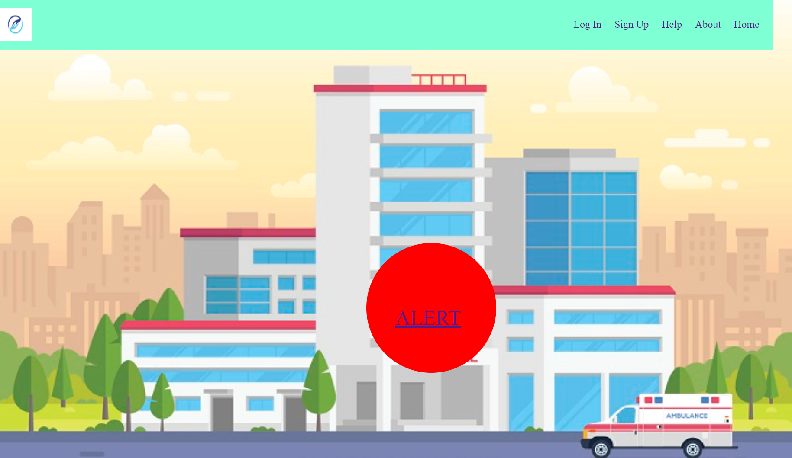
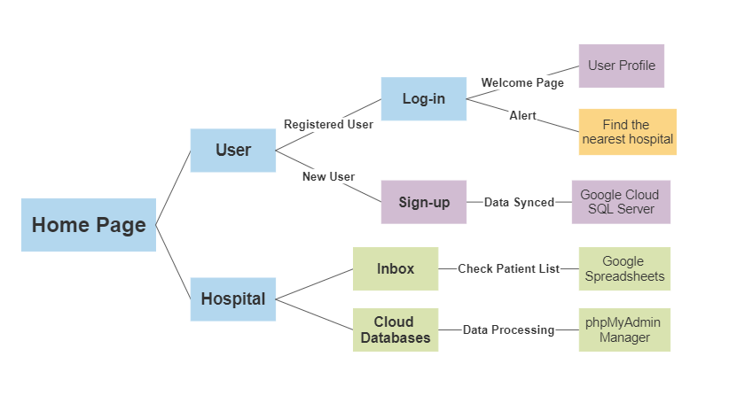

# New Year New Hack 2021
Developers: [NaviHelp](https://devpost.com/software/navihelp), January 1 - 3, 2021 on Devpost, Major League Hacking.
## Overview of New Year New Hack 2021
In this project, I worked on a hospital web building intertwined with back-end database management based on phpMyAdmin software and Google Cloud SQL server to connect remote patients with the nearest hospital during an emergency, which contains four major features:
* Registeration & Log-in form.
* A notification  system on the hospital-side.
* Alert on the patient-side.
* Location tracker for patients to find the nearest hospital.
* Data processing system based on Google Cloud Platform.
## Video Demo

<div align="left">
      <a href="https://www.youtube.com/watch?v=hDSn6I9p4qg&feature=youtu.be">
     
      </a>
    </div>
    
---

## **File Structure**
<p align="left"></p>

---

## Technologies & Platforms
Front-End Stack: HTML5, CSS3, JavaScript, jQuery, Visual Studio Code.

Back-End Stack: PHP, SQL, XAMPP, phpMyAdmin, Google Cloud SQL, AppSheet.

## Simple Steps to Run (Windows)


### XAMPP Installation

I used XAMPP as a cross-platform web server for database management, including Apache HTTP Server, MySQL database server, and the phpMyAdmin web interface.

* Follow this [**link**](https://www.apachefriends.org/download.html) to install Xampp on Windows.
* Refer to this **[link](https://www.apachefriends.org/faq_windows.html)** for FAQs. 

### phpMyAdmin Directions (Local Sever):
Please clone this repo on your computer (or virtual machine):
```shell
git clone https://github.com/wzy0766/NewYearNewHack2021.git
cd NewYearNewHack2021/
```
* Move all folders from **NewYearNewHack2021/** into **C:\xampp\htdocs**
* Run **xampp-control.exe** as an administrator, then start its apache server and MySQL database server.
* Open the browser (Chrome is recommended) and type **localhost/hopital/hospoutlook.html** to view the hospital-side home page.
* Open the browser (Chrome is recommended) and type **localhost/user/user.html** to view the user-side home page.

### phpMyAdmin Directions (Google Cloud Server):

* Find and open **config.inc.php** under the path of **C:\xampp\phpMyAdmin**.
* Insert the following text in this document to access the cloud server on the phpMyAdmin web page:
```
$i++;
$cfg['Servers'][$i]['host'] = '35.202.184.238';
$cfg['Servers'][$i]['user'] = 'root';
$cfg['Servers'][$i]['password'] = '';
$cfg['Servers'][$i]['auth_type'] = 'config';
$cfg['Servers'][$i]['extension'] = 'mysqli';
$cfg['Servers'][$i]['AllowNoPassword'] = true;
```
> * Notice: **35.202.184.238** is the public IP address of my Google Cloud server, you may change it to your own Google Cloud pubilc IP address. 
> * Visit this [**link**](https://cloud.google.com/sql/docs/mysql/quickstart) to create your own Google Cloud server.
> 
* Again, run **xampp-control.exe** as an administrator, then start its **apache** and **MySQL**, click the **Admin** button under the **MySQL** section.
* You can now switch your current server locally or remotely by checking the **current server** selection menu, which is in the leftmost corner of the page.

## Further works
We would love to expand the website and implement more features to connect users to hospitals and more first responders!
